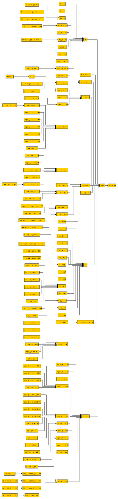

Readme
======
This is a mostly useless exercise in parsing in plain C. The tool implements a textbook top-down recursive descent parser for a subset of Verilog-95, one typical for a netlist. It implements a bunch of hacks and outright errors as well.

To make:
`make`

Build defaults to a debug build with no optimization.
There are no dependencies except for libC.

To run:
`./pnetlist <path_to_netlist_file>`

Output graph is stored in `output.dot`, in [Graphviz](https://graphviz.org/doc/info/lang.html) format.
The program implicitly reads in `ignore_pfx.txt`. If found, each line stands for a module prefix to be ignored. This is used to filter out not too interesting modules like leaf and tech memory cells.

Parsed file is used to build a dependency/instantiation graph, like the one below:

This particular one is the representation of [SPARC T1](https://www.oracle.com/servers/technologies/opensparc-t1-page.html) Netlist, synthesized for modern 6-input LUT Xilinx FPGA and rendered by [yEd](https://yed.yworks.com). The dot file needs some further processing before it gets accepted by yEd:

`gv2gml output.dot > output.gml`

`sed -i s/name/label/ output.gml`

